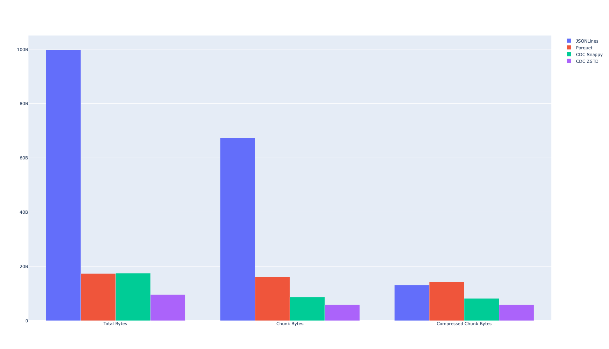

# Dedupe Estimator

This estimates the amount of chunk level dedupe available in a
collection of files. All files will be chunked together
so if there are multiple versions of the file, all versions
should be provided together to see how much can be saved
using Hugging Face's dedupped storage architecture.

The chunking algorithm used here is **not** the same
as the one being deployed. Notably, for simplicity this does not
even use a secure hash method for chunk hashes and just uses
std::hash. This means that collisions are plausible and
exact numbers may actually vary from run to run.
But it should provide a reasonable estimate.

UNDER CONSTRUCTION: note that this repository contains a quickly
written python binding to https://github.com/huggingface/dedupe_estimator
in order to evaluate deduplication efifciency for parquet files.

# PyArrow Implementation

The implementation hasn't been merged upstream yet, it is available under
the https://github.com/kszucs/arrow/tree/content-defined-chunking branch.

# Quick Start

Compile:

```bash
python setup.py develop
```

This will install a command line tool called `de`.

## Available Commands

Run the deduplication estimator on two or more files:

```bash
de dedup a.parquet b.parquet
```

Generate synthetic data and visualize deduplication:

```bash
de synthetic targetdir
```

Checkout all revisions of a file within a git repository:

```bash
❯ de revisions -d /tmp/datasets ~/Datasets/hub-stats/datasets.parquet
datasets.parquet has 194 revisions
Checking out 50a6ff0
Checking out 1ae78e6
Checking out 03613ea
...
```

Generate deduplication statistics for a directory of parquet files:

```bash
❯ de stats /tmp/datasets
Writing jsonlines files
100%|██████████████████████████████████████████| 194/194 [01:03<00:00,  3.07it/s]
Writing parquet files
100%|██████████████████████████████████████████| 194/194 [00:21<00:00,  8.95it/s]
100%|██████████████████████████████████████████| 194/194 [00:16<00:00, 11.90it/s]
Estimating deduplication ratios
100%|███████████████████████████████████████████| 4/4 [00:00<00:00, 37365.74it/s]
┏━━━━━━━━━━━━┳━━━━━━━━━━━━┳━━━━━━━━━━━━┳━━━━━━━━━━━━━┳━━━━━━━━━━━━━┳━━━━━━━━━━━━┓
┃            ┃            ┃            ┃             ┃             ┃ Compressed ┃
┃            ┃            ┃            ┃  Compressed ┃ Deduplicat… ┃ Deduplica… ┃
┃ Title      ┃ Total Size ┃ Chunk Size ┃  Chunk Size ┃       Ratio ┃      Ratio ┃
┡━━━━━━━━━━━━╇━━━━━━━━━━━━╇━━━━━━━━━━━━╇━━━━━━━━━━━━━╇━━━━━━━━━━━━━╇━━━━━━━━━━━━┩
│ JSONLines  │   93.0 GiB │   62.7 GiB │    12.2 GiB │         67% │        13% │
│ Parquet    │   16.2 GiB │   14.9 GiB │    13.3 GiB │         93% │        82% │
│ CDC Snappy │   16.2 GiB │    8.1 GiB │     7.6 GiB │         50% │        47% │
│ CDC ZSTD   │    8.9 GiB │    5.4 GiB │     5.4 GiB │         61% │        61% │
└────────────┴────────────┴────────────┴─────────────┴─────────────┴────────────┘
```

It also generates a plot comparing the results:



# Parquet Deduplication

[Apache Parquet](https://parquet.apache.org/) is a columnar storage format that
is widely used in the data engineering community. It is a binary file format that
stores data in a columnar fashion, which allows for efficient reads and writes.

## Brief Description of the Implementation

...

## Results on Synthetic Data with a Single Column `a: int`

The experiment can be reproduced by running the following command:

```bash
❯ de synthetic -s $S -e $E '{"a": "int"}'
```

This will generate `$S` million (2^20) records of schema `<a: int>` with variants
including `$E` edits (inserted/deleted/updated block of 10 records) evenly 
distributed in the table and another variant with 5% of the records appended to 
the end. The resulting parquet files have `$S` row groups.

## Results on Synthetic Data with a Single Column `a: int` and 1Mi Rows

```bash
❯ de synthetic -s 1 -e 1 '{"a": "int"}'
❯ de synthetic -s 1 -e 2 '{"a": "int"}'
```

### Append - 1Mi Rows 1 Column:

| Compression | Vanilla Parquet                                 | CDC Parquet                                   |
| :---------: | ----------------------------------------------- | --------------------------------------------- |
|    None     |    |    |
|   Snappy    |  |  |
|    ZSTD     |    |    |

### Update - 1Mi Rows 1 Column 1 Edit:

| Compression | Vanilla Parquet                                  | CDC Parquet                                    |
| :---------: | ------------------------------------------------ | ---------------------------------------------- |
|    None     |    |    |
|   Snappy    |  |  |
|    ZSTD     |    |    |

### Update - 1Mi Rows 1 Column 2 Edits:

| Compression | Vanilla Parquet                                  | CDC Parquet                                    |
| :---------: | ------------------------------------------------ | ---------------------------------------------- |
|    None     |    |    |
|   Snappy    |  |  |
|    ZSTD     |    |    |

### Insert - 1Mi Rows 1 Column 1 Edit:

| Compression | Vanilla Parquet                                 | CDC Parquet                                   |
| :---------: | ----------------------------------------------- | --------------------------------------------- |
|    None     |    |    |
|   Snappy    |  |  |
|    ZSTD     |    |    |

### Insert - 1Mi Rows 1 Column 2 Edits:

| Compression | Vanilla Parquet                                 | CDC Parquet                                   |
| :---------: | ----------------------------------------------- | --------------------------------------------- |
|    None     |    |    |
|   Snappy    |  |  |
|    ZSTD     |    |    |

### Delete - 1Mi Rows 1 Column 1 Edit:

| Compression | Vanilla Parquet                                | CDC Parquet                                  |
| :---------: | ---------------------------------------------- | -------------------------------------------- |
|    None     |    |    |
|   Snappy    |  |  |
|    ZSTD     |    |    |

### Delete - 1Mi Rows 1 Column 2 Edits:

| Compression | Vanilla Parquet                                | CDC Parquet                                  |
| :---------: | ---------------------------------------------- | -------------------------------------------- |
|    None     |    |    |
|   Snappy    |  |  |
|    ZSTD     |    |    |

## Results on Synthetic Data with a Single Column `a: int` and 4Mi Rows

The experiment can be reproduced by running the following command:

```bash
❯ de synthetic -s 4 -e 1 '{"a": "int"}'
❯ de synthetic -s 4 -e 2 '{"a": "int"}'
```

### Append - 4Mi Rows 1 Column:

| Compression | Vanilla Parquet                                 | CDC Parquet                                   |
| :---------: | ----------------------------------------------- | --------------------------------------------- |
|    None     |    |    |
|   Snappy    |  |  |
|    ZSTD     |    |    |

### Update - 4Mi Rows 1 Column 1 Edit:

| Compression | Vanilla Parquet                                  | CDC Parquet                                    |
| :---------: | ------------------------------------------------ | ---------------------------------------------- |
|    None     |    |    |
|   Snappy    |  |  |
|    ZSTD     |    |    |

### Update - 4Mi Rows 1 Column 2 Edits:

| Compression | Vanilla Parquet                                  | CDC Parquet                                    |
| :---------: | ------------------------------------------------ | ---------------------------------------------- |
|    None     |    |    |
|   Snappy    |  |  |
|    ZSTD     |    |    |

### Insert - 4Mi Rows 1 Column 1 Edit:

| Compression | Vanilla Parquet                                 | CDC Parquet                                   |
| :---------: | ----------------------------------------------- | --------------------------------------------- |
|    None     |    |    |
|   Snappy    |  |  |
|    ZSTD     |    |    |

### Insert - 4Mi Rows 1 Column 2 Edits:

| Compression | Vanilla Parquet                                 | CDC Parquet                                   |
| :---------: | ----------------------------------------------- | --------------------------------------------- |
|    None     |    |    |
|   Snappy    |  |  |
|    ZSTD     |    |    |

### Delete - 4Mi Rows 1 Column 1 Edit:

| Compression | Vanilla Parquet                                | CDC Parquet                                  |
| :---------: | ---------------------------------------------- | -------------------------------------------- |
|    None     |    |    |
|   Snappy    |  |  |
|    ZSTD     |    |    |

### Delete - 4Mi Rows 1 Column 2 Edits:

| Compression | Vanilla Parquet                                | CDC Parquet                                  |
| :---------: | ---------------------------------------------- | -------------------------------------------- |
|    None     |    |    |
|   Snappy    |  |  |
|    ZSTD     |    |    |
